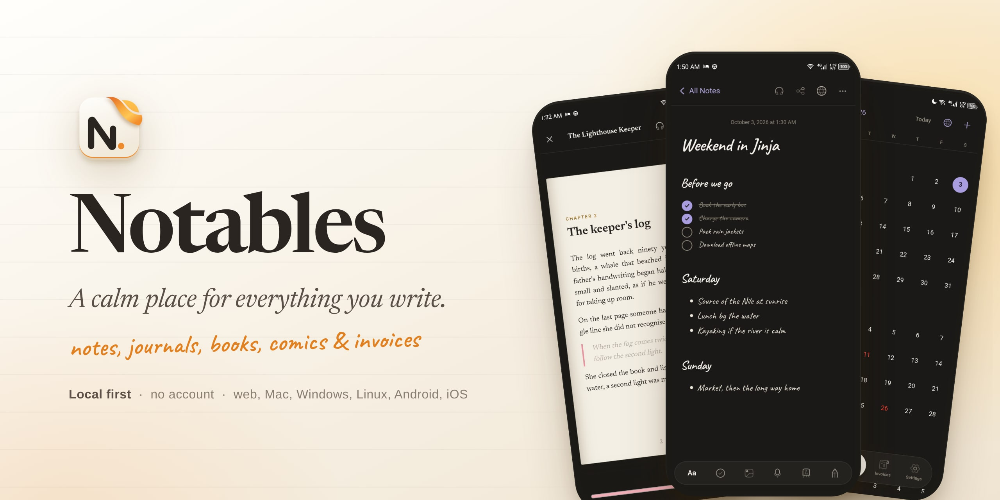

<p align="center">
  
</p>

<p align="center">
  <b>Notes, journals, stories, books, comics, audiobooks, invoices and plans,</b><br>
  kept on your own devices and shared only when you choose.
</p>

<p align="center">
  
  
  
  <a href="LICENSE"></a>
</p>

<p align="center">
  <a href="#-what-you-can-do">Features</a> ·
  <a href="#-private-by-design">Privacy</a> ·
  <a href="DEVELOPERS.md">Build it</a> ·
  <a href="docs/ROADMAP.md">Roadmap</a>
</p>

---

Notables is one app for writing, reading and keeping things: a quick note,
a journal, a story that grows into a book, a comic you're drawing, an
audiobook you're listening to, an invoice a client can verify. It opens
straight away, works without a connection, and never asks you to sign up.
Everything lives on your device first.

It's built from a single codebase for the web, macOS, Windows, Linux,
Android and iOS, and it follows each system's own conventions: its fonts,
haptics, keyboard, dark mode and text size.

## ✨ What you can do

<table>
  <tr>
    <td width="50%" valign="top">
      <h3>📝 Write anything</h3>
      Notes, journals, stories, articles, lessons and plans in an editor made
      for words: headings, quotes, lists, checklists, highlights, links,
      photos and audio, with Markdown shortcuts and a choice of fonts.
    </td>
    <td width="50%" valign="top">
      <h3>✍️ Write by hand</h3>
      Handwriting pages inside any note, with pen pressure and palm
      rejection. Draw comic, manga and picture-book pages in the studio,
      and come back to edit every stroke.
    </td>
  </tr>
  <tr>
    <td valign="top">
      <h3>📚 Make and read books</h3>
      Gather notes into books with parts and chapters, then read them with
      real page turns. Import EPUB, PDF, CBZ and audio, and read comics and
      manga in readers made for them.
    </td>
    <td valign="top">
      <h3>🎧 Listen and read along</h3>
      Audiobooks play throughout the app with a mini player. Read-along
      follows the words as they're spoken, transcribed on your device, and
      any note can be read aloud in a natural voice.
    </td>
  </tr>
  <tr>
    <td valign="top">
      <h3>🎙️ Record and transcribe</h3>
      Speak, and Notables writes it down with Whisper running on your
      device. Recordings stay beside the words they became.
    </td>
    <td valign="top">
      <h3>🗓️ Plan your days</h3>
      Plans, reminders, birthdays, anniversaries, deadlines and trips over
      several days. Day, week, month and year views, public holidays for
      your country, and "Type it" to add a plan from a sentence.
    </td>
  </tr>
  <tr>
    <td valign="top">
      <h3>🧾 Invoices you can prove</h3>
      Invoices, receipts and quotes with your business profile. Each carries
      a signed seal and a QR code, so anyone can check that a document is
      genuine and unchanged.
    </td>
    <td valign="top">
      <h3>🌐 Publish when you're ready</h3>
      Turn any note into a public page that readers can heart and rate.
      Update it or take it down whenever you like.
    </td>
  </tr>
  <tr>
    <td valign="top">
      <h3>🤝 Share with people, not servers</h3>
      Write together with specific people, device to device, and see who's
      around in Connections. Nothing passes through an account.
    </td>
    <td valign="top">
      <h3>📦 Take it all with you</h3>
      Export to EPUB, PDF, Word, HTML, Markdown, plain text, CBZ, image
      archives and audiobook folders. Deleted things wait a week in
      Recently Deleted.
    </td>
  </tr>
  <tr>
    <td valign="top">
      <h3>📲 At a glance</h3>
      A Today widget for your home screen or desktop with your next plans
      and pinned notes, haptics that follow your system, and
      <code>notables://</code> links straight to a note or a book.
    </td>
    <td valign="top">
      <h3>🌍 In your language</h3>
      English, French, Spanish, Portuguese, Swahili and Arabic, with the
      whole interface turning right to left for Arabic.
    </td>
  </tr>
</table>

## 🔒 Private by design

- **No account.** Notables works fully the moment it opens. Your name stays
  on your device and appears only on what you publish.
- **On your device first.** Notes live in a database on your device and
  media as ordinary files. It all works offline.
- **AI only if you ask.** AI help is off by default. Turn it on with your
  own Claude, Gemini or OpenRouter key, and it talks to that provider alone.
- **Speech stays local.** Transcription and natural voices run on your
  device, from model packs you choose to download.

## 🛠️ Build it yourself

Notables is open source. The web app runs with two commands:

```sh
bun install
bun run dev        # http://localhost:3000
```

Native apps, the stack, the repository map, checks and deployment are all
in **[DEVELOPERS.md](DEVELOPERS.md)**. How to propose a change is in
[CONTRIBUTING.md](CONTRIBUTING.md).

## 🧭 Where it's going

Notables is young (version 0.1). Coming next: streaming transcription
while you record, optional sign-in with cloud backup and a relay for
sharing when people aren't online together, lessons and flashcards, and
the iOS app. The [roadmap](docs/ROADMAP.md) has the details.

## 📄 License

[MIT](LICENSE) © Pherus
