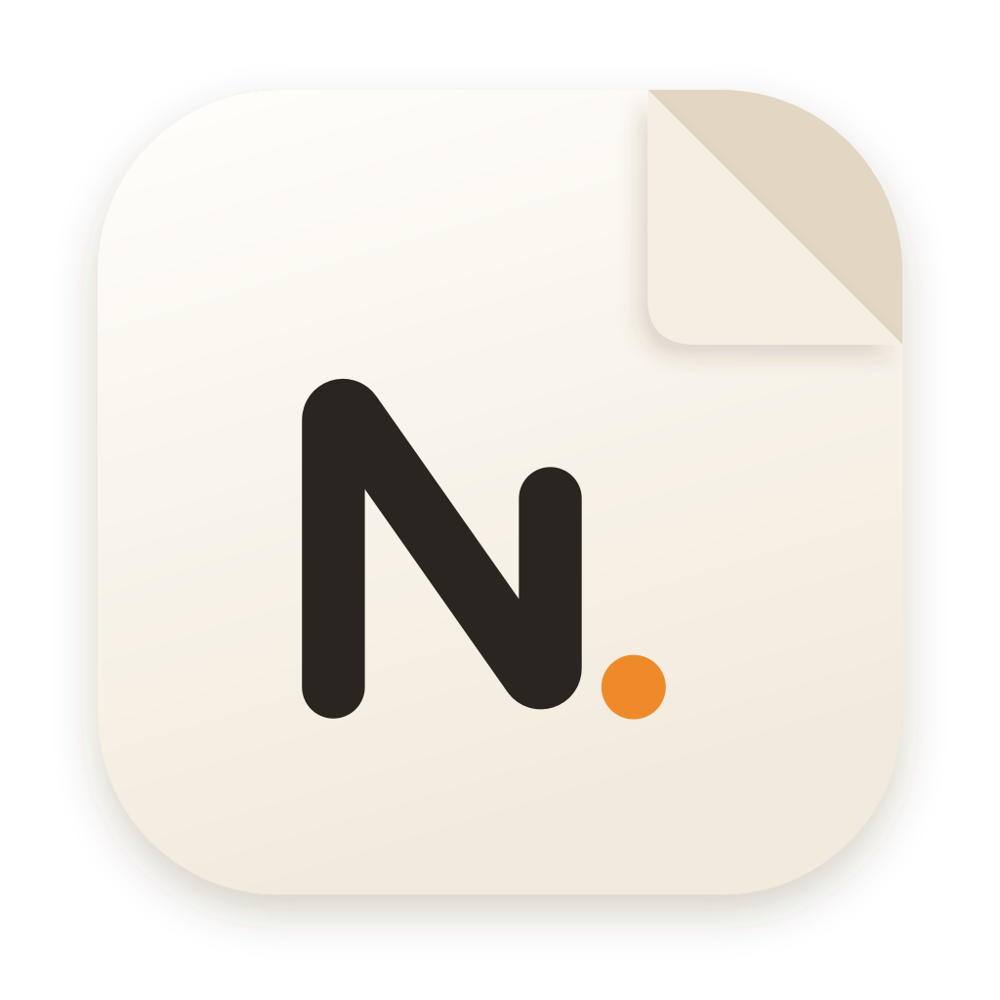

<p align="center">
  
</p>

<h1 align="center">Notables</h1>

<p align="center">
  <b>Anything notable, always with you.</b><br>
  Notes, journals, stories, books, comics, audiobooks, invoices and plans,<br>
  kept on your own devices and shared only when you choose.
</p>

<p align="center">
  
  
  
  <a href="LICENSE"></a>
</p>

<p align="center">
  <a href="https://notables.pherus.org"><b>Open the web app</b></a> ·
  <a href="https://pherus.org/showcase/notables">See it in action</a> ·
  <a href="#-what-you-can-do">Features</a> ·
  <a href="DEVELOPERS.md">Build it</a> ·
  <a href="docs/ROADMAP.md">Roadmap</a>
</p>

<p align="center">
  <a href="https://pherus.org/showcase/notables"></a>
  <a href="https://pherus.org/showcase/notables"></a>
</p>

---

Notables is one calm app for writing, reading and keeping things: a quick
note, a journal, a story that grows into a book, a comic you're drawing, an
audiobook you're listening to, an invoice a client can verify. It opens
straight away, works without a connection and never asks you to sign up.

One codebase runs on the web, macOS, Windows, Linux, Android and iOS, and on
each it follows the system's own fonts, haptics, keyboard, dark mode and
text size.

## 📥 Get Notables

| Where | Status |
|---|---|
| **Web** | [notables.pherus.org](https://notables.pherus.org) |
| **Android** | Testing on Google Play (invite only for now) |
| **iPhone and iPad** | Testing on TestFlight (invite only for now) |
| **macOS, Windows, Linux** | Build from source ([DEVELOPERS.md](DEVELOPERS.md)); installers to follow |

## ✨ What you can do

<table>
  <tr>
    <td width="50%" valign="top">
      <h3>📝 Write anything</h3>
      An editor made for words: headings, lists, checklists, highlights,
      photos and audio, Markdown shortcuts and a choice of fonts. Swipe a
      note to pin or delete it, or hold and slide to select several.
    </td>
    <td width="50%" valign="top">
      <h3>✍️ Write and draw by hand</h3>
      Handwriting pages with pen pressure and palm rejection, and a studio
      for comic, manga and picture-book pages where every stroke stays
      editable.
    </td>
  </tr>
  <tr>
    <td valign="top">
      <h3>📚 Make and read books</h3>
      Gather notes into books with parts and chapters and read them with
      real page turns. Import EPUB, PDF, CBZ and audio; comics and manga get
      readers of their own.
    </td>
    <td valign="top">
      <h3>🎧 Listen and read along</h3>
      Audiobooks with a mini player, read-along that follows each word, and
      any note read aloud in a natural voice that runs on your device.
    </td>
  </tr>
  <tr>
    <td valign="top">
      <h3>🎙️ Record and transcribe</h3>
      Speak, and Whisper writes it down on your device. Recordings stay
      beside the words they became.
    </td>
    <td valign="top">
      <h3>🗓️ Plan your days</h3>
      Plans, reminders, birthdays, deadlines and trips in day, week, month
      and year views, with your country's public holidays and "Type it" to
      add a plan from a sentence.
    </td>
  </tr>
  <tr>
    <td valign="top">
      <h3>🧾 Invoices you can prove</h3>
      Invoices, receipts and quotes with your business profile, each with a
      signed seal and a QR code anyone can scan to check it's genuine.
    </td>
    <td valign="top">
      <h3>💳 A private wallet</h3>
      Copies of your bank cards, IDs, passport and SIM details, scanned with
      the camera and encrypted on your device. They never leave it.
    </td>
  </tr>
  <tr>
    <td valign="top">
      <h3>🌐 Publish or share</h3>
      Turn a note into a public page readers can heart and rate, or write
      together with specific people, device to device.
    </td>
    <td valign="top">
      <h3>📦 Take it all with you</h3>
      Export to EPUB, PDF, Word, HTML, Markdown, text, CBZ and audiobook
      folders. Deleted things wait a week in Recently Deleted.
    </td>
  </tr>
</table>

Plus a Today widget, `notables://` links to any note or book, and the whole
interface in English, French, Spanish, Portuguese, Swahili, Arabic (right
to left) and Simplified Chinese.

## 🔒 Private by design

- **No account.** Notables works fully the moment it opens. Your name stays
  on your device and appears only on what you publish.
- **On your device first.** Notes live in a database on your device, media
  as ordinary files, and it all works offline.
- **AI only if you ask.** Off by default; turn it on with your own Claude,
  Gemini or OpenRouter key and it talks to that provider alone.
- **Speech stays local.** Transcription and natural voices run on your
  device from model packs you choose to download.

## 🧭 Where it's going

Notables is young (version 0.1). The next big piece is **your devices,
together**: link a phone, a laptop and the web by scanning a code, no
account, and pick up wherever you left off. Devices on the same network talk
directly; otherwise Cloudflare only passes encrypted data through and keeps
nothing. After that come friends by a shareable ID, writing together, and
opt-in public sharing helped along by the people who read it. The plan is
in [ADR-0007](docs/adr/0007-linked-devices-pass-through-network.md), still
being discussed, and the [roadmap](docs/ROADMAP.md) has the rest.

## 🗂️ Inside the repository

| Path | What it is |
|---|---|
| [`www/`](www) | The app: TanStack Start and React on Cloudflare Workers, and the frontend of every native build |
| [`www/src-tauri/`](www/src-tauri) | The Tauri 2 shell for iOS, Android, macOS, Windows and Linux: SQLite storage, media, on-device Whisper and voices, the encrypted wallet |
| [`packages/ultrapeach/`](packages/ultrapeach) | **UltraPeach**, our design language: tokens, text styles, materials, platform variants and components |
| [`packages/pluraliti/`](packages/pluraliti) | **Pluraliti**, the rich text editor built on Lexical and Yjs |
| [`packages/sync/`](packages/sync) | Yjs persistence and the peer-to-peer mesh |
| [`packages/notable-core/`](packages/notable-core) | Shared models: notes, invoicing, calendar recurrence |
| [`docs/`](docs) | [Architecture](docs/ARCHITECTURE.md), [decisions](docs/adr), [specs](docs/specs/www) and the [stage plan](docs/STAGES.md) |

## 🛠️ Build it yourself

```sh
bun install
bun run dev        # http://localhost:3000
```

Native apps, checks and deployment are in **[DEVELOPERS.md](DEVELOPERS.md)**;
how to propose a change is in [CONTRIBUTING.md](CONTRIBUTING.md).

## 🍑 Made by Pherus

Notables is made by [Pherus](https://pherus.org), a small software studio
in Kampala, Uganda, building calm, private software that works offline
first and feels at home on every platform.

Questions, ideas or bugs: [open an issue](../../issues).

## 📄 License

[MIT](LICENSE) © Pherus
